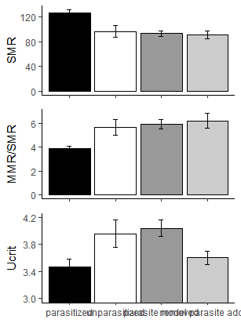

```{r setup, include=FALSE}
knitr::opts_chunk$set(echo = TRUE)
```

# Paper Overview

This is for the paper titled "Ectoparasites increase swimming costs in a coral reef fish" published in Biology Letters in 2012

## Background

{height=300px}
{height=300px}

Ectoparasites such as isopods can reduce the fitness of the fish they parasitize. However, there is little known about whether the energetic costs are due to changes in the streaming of the fish or by changes in the host's physiology. This paper used the Bridled Monocle Bream, *Scolopsis bilineatus*, an Indo-Pacific reef fish, and a natural parasite, the *Anilocra nemipteri* isopod to attemot to answer the question. This parasite can be up to 15% of the host's body length, leading to possible changes to the fish's streamlining. They wanted to separate out what changes were from each of the two possibilities by testing fish from parasitized and unparasitized groups, as well as groups that had parasites removed, and a group that had fake parasites added.

## Data Used and Analysis

The data for this paper is in the Dryad Repository, found [here](https://datadryad.org/stash/dataset/doi:10.5061/dryad.r73v3).
There are two data files. The first has the data for speed and MO2, which is the oxygen consumption rate for the fish. The second file has the data on metabolic rates, critical swimming speed, and aerobic scope. The paper also references data on the size and mass of the fish used and the size of the parasites, but the data isn't included in the repository.
The authors measured the standard and maximum metabolic rates and the critical speed, using it to calculate a oxygen consumption curve and the aerobic scope. They ran one-way ANOVAs  to compare Ucrit, SMR, MMR, and AS between treatments. They also used a linear mixed effect model to look at the difference between oxygen consumption rate curves.

## Replication Done

I replicated the mean and se calculations for the variables, all the ANOVAs and PostHoc tests, as well as both Figures 1 and 2. I also replicated the regressions for the MO2 curves.

# Bringing in Data

First we need to call in the data from the original paper. The data is linked to [here](https://datadryad.org/stash/dataset/doi:10.5061/dryad.r73v3)
but I downloaded it.

## Bringing into Excel

There are 2 .txt files that I cleaned up in excel to save as .csv.  The text file had each line, with all the data for a single fish, enclosed in " ", but I removed them when I opened the file in excel. I separated the variables to different columns. There was no missing data, no 0s or NAs, so I didn't change any values. I just saved it as a csv.

## Read into R

```{r, warning=F, message=F}
#This is for all the libraries I will need
library(curl)
library(ggplot2)
library(plyr)
library(dplyr)
library(nlme)
library(agricolae)
library(multcompView)
library(grid)
library(gtable)
library(lsmeans)
```

We are reading the .csv into R and looking at the data
```{r}
f <- "~/GitHub/Paper Recreation Project/ParasiteData.csv"

d <- read.csv(f, header = TRUE, sep =",", stringsAsFactors = FALSE)
head(d)
#it's not right, the column names werent imported correctly, so we fix that...
colnames(d)<- c("Fish ID", "Treatment", "Speed", "MO2")
head(d)
summary(d)
```

We also need to read in the other file with the values they used for their ANOVA, which I plan on re-doing

```{r}
e<- "~/GitHub/Paper Recreation Project/ANOVAdata.csv"
g<- read.csv(e, sep=",")
summary(g)
head(g)
```
* Fish= Fish ID
* Treatment= unparasitized (UN), parasitized (P), parasite removed (REM), parasite added(FUN)
* SMR= standard metabolic rate
* MMR= maximum metabolic rate
* AS= factorial aerobic scope
* Ucrit= critical swimming speed

## Cleaning data

Once I got the data into R, I had to fix a couple of problems.
The two tables have different ways of naming the treatments. I am going to fix them so they both sort the same way
```{r}
#This line gives the new names in relation to the original
treats<- c(P = "1_P", UN= "2_UN", FUN = "3_FUN", REM= "4_REM")
#This fixes the names in the file
g$Treatment <- recode(g$Treatment, !!!treats)

#This line is to be used with the graphs, which are in a different order than the variable names
treat.order<- c("1_P", "2_UN", "4_REM", "3_FUN")
```

# Running Stats

## Checking Normality
First I checked the normality for all the variables, as they are used in ANOVAs, regardless of the fact that the authors do not mention it in the paper.
```{r}
hist(d$MO2)
```

This histogram doesn't seem very normal.
```{r}
qqnorm(d$MO2, xlab="Theoretical",main="MO2")
qqline(d$MO2)
shapiro.test(d$MO2)
```
This data is clearly not normal, which is good to keep in mind going forward.

These are my tests for normality for data in the second file
```{r, echo=F}
#SMR
par(mfrow=c(1,2))
hist(g$SMR)
qqnorm(g$SMR, xlab="Theoretical",main="SMR")
qqline(g$SMR)
shapiro.test(g$SMR)
#MMR
par(mfrow=c(1,2))
hist(g$MMR)
qqnorm(g$MMR, xlab="Theoretical",main="MMR")
qqline(g$MMR)
shapiro.test(g$MMR)
#AS
par(mfrow=c(1,2))
hist(g$AS)
qqnorm(g$AS, xlab="Theoretical",main="AS")
qqline(g$AS)
shapiro.test(g$AS)
#Ucrit
par(mfrow=c(1,2))
hist(g$Ucrit)
qqnorm(g$Ucrit, xlab="Theoretical",main="Ucrit")
qqline(g$Ucrit)
shapiro.test(g$Ucrit)
```
SMR and MMR look pretty normal. Additionally, both pass the Shapiro test for normality. AS is close to normal until the edges of the qqplot, but doesn't pass the Shapiro test. Ucrit looks fairly non-normal, but has a p value of about 0.05 in the Shapiro test, so it is walking the edge of normality.


## Means & SE

The paper has descriptive stats for the average size, as length and mass, of the fish as well as stats for the parasites removed from the paper. However, they have no data to go with these analysis in their repository.

There are means for MO2, the ratio of MMR/SMR, and U that are used to create Figure 1.
So first I will recreate Figure 1


First I need to calculate the mean MO2, MMR/SMR, Ucrit, and the se per treatment.
Also, a problem/question: The figure legend says the first graph is SMR, but the graph itself says it is MO2, which are 2 different numbers. hmmm. Seems *fishy*.

### Means for MO2, Fig. 1a
```{r}
#First we get the mean for each treatment
MO.m<- aggregate(d[,4], list(d$Treatment), mean)
#Then the se for each treatment
se <- function(x) sqrt(var(x)/length(x))
MO.se<- aggregate(d[,4], list(d$Treatment), se)
#make 1 chart to make my life simple
MO<- cbind(MO.m, MO.se[,2])
colnames(MO)<- c("Treatment","mean","SE")
#graph
m<- ggplot(data=MO, aes(Treatment, mean)) + geom_bar(stat="identity", color="black")+ geom_errorbar(aes(ymin=mean-SE, ymax=mean+SE))
m
```

This graph doesn't match Fig. 1a that is in the paper, the mean is too high. I am going to check the range of numbers for MO2 and see what they look like to check that the coding worked, and the issue is actually the data.
```{r}
summary(d$MO2)
```

So the range of MO2s doesn't match the range on the graph. The maximum for MO2 is much higher than is on the graph. Even taking the fact that the graph is the means, it seems far to high to be correct.

I'll try the SMR, which the legend says
```{r}
#Check the range
summary(g$SMR)
```

The ranges seem much more reasonable to go with the graph, so I will try making the graph again.
```{r}
#calculate values
SMR.m<- aggregate(g[,3], list(g$Treatment), mean)
SMR.se<- aggregate(g[,3], list(g$Treatment), se)
SMR<- cbind(SMR.m, SMR.se[,2])
colnames(SMR)<- c("Treatment","mean","SE")

#graph
s<- ggplot(data=SMR, aes(Treatment, mean, y, fill=Treatment)) + geom_bar(stat="identity", color="black")+ geom_errorbar(aes(ymin=mean-SE, ymax=mean+SE), width=.1) + scale_x_discrete(limits=c("1_P", "2_UN", "4_REM", "3_FUN"), labels= c("parasitized", "unparasitized", "parasite removed", "model parasite added")) + scale_y_continuous(breaks=c(0,40,80,120), name = "SMR") + scale_fill_manual(values=c("#cccccc","#000000","#999999","#ffffff"))+theme(legend.position = "none", axis.title.x = element_blank(), panel.grid.major = element_blank(), panel.grid.minor = element_blank(), panel.background = element_blank(), axis.line = element_line(color="black"))
s
```

I will need to calculate significance for adding notation, which I do later. I will also remove the x labels to put parts a-c together.

So Fig. 1a was made with SMR, which agrees with the legend. The Standard Metabolic Weight is related to MO2, as SMR is used as part of the equation to calculate MO2, but they are 2 different values, so the graph should have the y-axis labeled as SMR, which mine has done.

I also noticed that the order they have their treatments labeled is not the order that their graphs are, which is not wrong but is a bit annoying once it is stacking up with everything.

**Hopefully** the other 2 parts of the figure go better...

### Means for MMR/SMR, Fig. 1b


```{r}
#Calculate
mmr.m<- aggregate(g[,4], list(g$Treatment), mean)
mmr.se<- aggregate(g[,4], list(g$Treatment), se)
mmr<- cbind(mmr.m, mmr.se[,2])
colnames(mmr)<- c("Treatment","mean","SE")
#Get MMR/SMR
#SMR values were calculated above for Fig. 1
m.s.m<-mmr$mean/SMR$mean
#not sure this is how to get the SE
m.s.se<-mmr$SE/SMR$SE
m.s<- cbind(treat.order, m.s.m, m.s.se)
m.s<- as.data.frame(m.s)
colnames(m.s)<- c("Treatment","mean","SE")
m.s$mean<- as.numeric(levels(m.s$mean))
m.s$SE<- as.numeric(levels(m.s$SE))

#Graph
r<- ggplot(data=m.s, aes(Treatment, mean, y, fill=Treatment)) + geom_bar(stat="identity", color="black")+ geom_errorbar(aes(ymin=mean-SE, ymax=mean+SE)) + scale_x_discrete(limits=c("1_P", "2_UN", "4_REM", "3_FUN"), labels= c("parasitized", "unparasitized", "parasite removed", "model parasite added")) + scale_y_continuous(breaks=c(0,2,4,6,8), name = "MMR/SMR") + scale_fill_manual(values=c("#000000","#ffffff","#cccccc","#999999"))+theme(legend.position = "none", axis.title.x = element_blank())
r
```

So the error bars are clearly wrong. However, more importantly, the bars are not the same relative heights as they are in the paper. In the paper, REM appears slightly higher than UN and FUN, while in mine, FUN is the tallest, then REM, then UN. I'm going to ignore the error bars as they are currently a minor problem.

I wonder if the reason that my numbers are off is because I aggregated the data and then found the ratio. Next I tried using their AS value, which is the ratio of MMR to SMR. That way, it takes my issue off the table, since the ratio is calculated first.
```{r}
#This is with the data they calculated as AS
as.m<- aggregate(g[,5], list(g$Treatment), mean)
as.se<- aggregate(g[,5], list(g$Treatment), se)
as<- cbind(as.m, as.se[,2])
colnames(as)<- c("Treatment","mean","SE")
as
#Graph
a<- ggplot(data=as, aes(Treatment, mean, y ))  + geom_bar(stat="identity", color="black")+ geom_errorbar(aes(ymin=mean-SE, ymax=mean+SE)) + scale_x_discrete(limits=c("1_P", "2_UN", "4_REM", "3_FUN"), labels= c("parasitized", "unparasitized", "parasite removed", "model parasite added"))
a
```

This looks closer but the last two columns seem switched, as the graph in the paper looks like the Parasite Removed has the highest bar.
```{r}
as
```

This way has treatment 3, FUN,  with the highest AS, at 6, but their graph looks like treatment 4, REM, is slightly higher. And treatments 2-4 look like they are all above 6 in their graph.

So far I have tried 2 ways to get their AS numbers for Fig.1b: I have found the average MMR and SMR and dividing them out and I have divided MMR by SMR individually and then averaged(this one technically they did).

I'm going to try to calculate AS myself for each fish then average across treatments

```{r}
AS.Brenna<- cbind(g[,2], g[,4], g[,3])
colnames(AS.Brenna)<- c("Treatment", "MMR", "SMR")
#The treatments are getting put in worng. I need to switch them
#treats   <- c(P = "1_P", UN= "2_UN", FUN = "3_FUN", REM= "4_REM")
treats.2 <- c("1" = "3_FUN", "2"= "1_P", "3"= "4_REM", "4"= "2_UN")
AS.Brenna[,1] <- recode(AS.Brenna[,1], !!!treats.2)
AS.Brenna<- as.data.frame(AS.Brenna)
AS.Brenna$MMR<- as.numeric(as.character(AS.Brenna$MMR))
AS.Brenna$SMR<- as.numeric(as.character(AS.Brenna$SMR))
#AS.Brenna$MMR<- droplevels(AS.Brenna$MMR)
#AS.Brenna$CalculatedAS = NA
#calc.AS<- AS.Brenna$MMR / AS.Brenna$SMR
AS.Brenna<- mutate(AS.Brenna, CalculatedAS=MMR/SMR)
AS.Brenna$CalculatedAS<- round(AS.Brenna$CalculatedAS, digits = 2)
match(AS.Brenna$CalculatedAS, g$AS)
```
There are 4 values that dont match, the 10th, 16th, 20th, and the 28th

```{r}
my.calc<-c(AS.Brenna[10,4],AS.Brenna[16,4],AS.Brenna[20,4],AS.Brenna[28,4])
their.calc<-c(g[10,5], g[16,5],  g[20,5], g[28,5])
              rbind(my.calc, their.calc)
```
It just looks like rounding for all of these, so the math checks out, which means that this should be exactly the same
```{r}
aggregate(AS.Brenna[,4], list(AS.Brenna$Treatment), mean)
```
```{r}
as
```

And they match. So their calculations for AS are right.
Since all the calculations are correct, the most likely explanation is that they took out outlier points, and didn't mention them in the paper. So the graph that I am going with is with their calculated AS values, since it seems like all the math adds up.
```{r}
a<- ggplot(data=as, aes(Treatment, mean, y, fill=Treatment)) + geom_bar(stat="identity", color="black")+ geom_errorbar(aes(ymin=mean-SE, ymax=mean+SE), width=.1) + scale_x_discrete(limits=c("1_P", "2_UN", "4_REM", "3_FUN"), labels= c("parasitized", "unparasitized", "parasite removed", "model parasite added")) + scale_y_continuous(breaks=c(0,2,4,6,8), name = "MMR/SMR") + scale_fill_manual(values=c("#cccccc","#000000","#999999","#ffffff"))+theme(legend.position = "none", axis.title.x = element_blank(), panel.grid.major = element_blank(), panel.grid.minor = element_blank(), panel.background = element_blank(), axis.line = element_line(color="black"))
a
```

### Means for U, Fig. 1c

```{r}
#Calculation
u.m<- aggregate(g[,6], list(g$Treatment), mean)
u.se<- aggregate(g[,6], list(g$Treatment), se)
u<- cbind(u.m, u.se[,2])
colnames(u)<- c("Treatment","mean","SE")
#this changes the names of the treatments
u$Treatment<- c("model parasite added","parasitized",  "parasite removed", "unparasitized")
#this changes the levels for the treatments
levels(u$Treatment) <-c("parasitized", "unparasitized", "model parasite added", "parasite removed")
u
#Graph
c<- ggplot(data=u, aes(Treatment, mean, y, fill=Treatment )) + geom_bar(stat="identity", color="black") +geom_errorbar(aes(ymin=mean-SE, ymax=mean+SE), width=.1) +
scale_fill_manual(values=c("#cccccc","#999999","#000000", "#ffffff")) + scale_y_continuous(name = "U (body length s-1)",breaks=c(3,3.4,3.8,4.2))+ coord_cartesian(ylim=c(3,4.2))+theme(legend.position = "none", axis.title.x = element_blank(), panel.grid.major = element_blank(), panel.grid.minor = element_blank(), panel.background = element_blank(), axis.line = element_line(color="black"))+scale_x_discrete(limits= c("parasitized", "unparasitized", "parasite removed", "model parasite added"),labels=function(labels) {
    sapply(seq_along(labels), function(i) paste0(ifelse(i %% 2 == 0, '', '\n'), labels[i]))
  })
c
```

This graph seems to match the paper pretty well. The numbers and order match up.

## Figure 1

I am going to make 1 graph.
```{r}
#This is to remove the x axis labels from the first 2 graphs
s<- s+theme(legend.position = "none", axis.title.x = element_blank(),axis.text.x = element_blank())
a<- a+theme(legend.position = "none", axis.title.x = element_blank(),axis.text.x = element_blank())


#then I need to convert the graphs to Grobs
s2<- ggplotGrob(s)
a2<- ggplotGrob(a)
c2<- ggplotGrob(c)
#then we set the sizes to be the same
b <-rbind(s2,a2,c2, size="first")
grid.newpage()
grid.draw(b)
```

And this is the original I was recreating next to it




## ANOVAs

They used 1-way ANOVA and a Tukey HSD post hoc test to examine the difference between Ucrit, SMR, MMR, and AS between treatments. They log transformed AS.

All ANOVAs work with factors, so I want to make sure that Treatment is a factor
```{r}
str(g$Treatment)
summary(g$Treatment)
```

### Ucrit ANOVA

First I will look at the data to see if I can visually spot a trend
```{r}
plot(g$Ucrit~ g$Treatment)
```

It looks like the Removed and possible the Unparasitized groups may be higher than the other 2.

For the ANOVA
```{r}
#First I am going to reorder the factors
g$Treatment <- factor(g$Treatment, levels = c("1_P", "2_UN", "3_FUN", "4_REM"))

#Then I run the test
U.an<- aov(data=g, g$Ucrit~ g$Treatment)
summary(U.an)
```
They reported that P and FUN were slower than the others, with the stat of F 3,34=4.922, p<.01
The test says that there is a significant difference at the level of 0.01. The p value matches the paper, but their F value was 4.922 and mine was 4.291.

```{r}
#Then the Post-Hoc, 2 ways
post.u<- TukeyHSD(U.an)
post.u

post.u2<- HSD.test(U.an, "g$Treatment", console = T)
```

The reported a Tukey's p value  of <0.01 for all contrasts.
According to the 1st Post Hoc, the only pair that is significantly different at 0.01 is between Parasitized and Removed groups, with REM being slightly faster. However there is a trend that the Parasitized and Added groups are very similar and the Unparasitized and Removed groups are very similar.
This doesn't match the paper which said they had a Tukey value of <0.01 for all the contrasts.

The second test gives the letters of groups that are statistically similar. It has the same finding as the first, that only REM and P are different. This is not the letter scheme that the graph had, so that was incorrect. Their graph has P and FUN in a group that is significantly different than REM and UN as a group.


### SMR ANOVA

First I will visualize the data
```{r, echo=F}
plot(g$SMR~ g$Treatment)
```

The Parasitized group looks like it will be different, and maybe the unparasitized group as well.
Then I'll run the test.
```{r, echo=F}
smr.an<- aov(data=g, g$SMR~ g$Treatment)
summary(smr.an)
```
They reported that P had a higher SMR than the other 3 treatments with a value of F 3,34=7.152, p<0.001. The p value and the F value both match with the paper.

Then I check the Post Hocs
```{r, echo=F}
post.smr<- TukeyHSD(smr.an, "g$Treatment", conf.level = 0.95)
post.smr
```
The Post Hoc test show the largest difference between Parasitized and everything else. The other 3 groups are all very similar to each other, which matches the paper.

```{r, echo=F}
post.smr2<- HSD.test(smr.an, "g$Treatment", console = T)
```
The second Post Hoc test gives the letter groups as P being one group and everything else as a second group, which matches the paper.


### MMR ANOVA

First I will visualize the data
```{r, echo=F}
plot(g$MMR~ g$Treatment)
```

They all look relatively similar. FUN and REM are slightly higher, but I doubt it is significant.

Then run the test
```{r, echo=F}
mmr.an<- aov(data=g, g$MMR~ g$Treatment)
summary(mmr.an)
```
The paper reported no difference between groups, with a statistic of F 3, 34= 0.992, p=0.408. There is no significant difference between groups, which matches the paper. My numbers are slightly different, however. My stat is F 3, 34= 0.963, p= 0.421. So while neither number matches exactly, they both come to the same conclusion.
```{r, echo=F}
#Tukey Test
post.mmr<- TukeyHSD(mmr.an, "g$Treatment", conf.level = 0.95)
post.mmr
```
The post hoc test shows that nothing is even close to significance, which the paper agrees with. They do not report a value for the Tukey, presumably because there was no difference.

### AS ANOVA- log transformed

First I will visualize the data, which was log10 transformed.
```{r}
plot(log10(g$AS)~ g$Treatment)
```

The Parasitized group looks like it will be lower than the other three treatment.
Then I run the tests.
```{r}
as.an<- aov(data=g, log10(g$AS)~ g$Treatment)
summary(as.an)
```
There is a significant difference at the level of 0.001, which matches the paper. However, the paper reported a value of 8.897 for the F value, while the test gave me a value of 6.543, which is pretty different.

The first Tukey test
```{r, echo=F}
post.as<- TukeyHSD(as.an, "g$Treatment", conf.level = 0.95)
post.as
```
The paper reported that the P group was lower than all 3 other groups, with a p value of <0.01. However, while there is a difference, 2 of the comparisons are not below the level of p=<0.01. Between P and REM there is only significance at a level of 0.05, and the difference between P and UN isn't significant at all.
```{r, echo=F}
post.as2<- HSD.test(as.an, "g$Treatment", console = T)
```
The significance letters has one group that is P and UN, and another that is UN, REM, and FUN, which also contradicts the statement in the paper.


## Figure 2

For Fig 2, I am starting with the base of the plot, which is the mean and SE of the logMO2 for each treatment at each speed.

Plotting the start of Fig 2
```{r}
#for each treatment, each x value has a point with error bars and a regression line

#want to get the mean for each treatment at each speed
f2.mean<-aggregate(log(d$MO2), list(d$Treatment, d$Speed), mean)
#the se for each treatment at each speed
f2.se<-aggregate(log(d$MO2), list(d$Treatment, d$Speed), se)
#then put in one table
f2<- cbind(f2.mean, f2.se[,3])
colnames(f2)<- c("Treatment","Speed","mean", "SE")
head(f2)

j2<- ggplot(data=f2,aes(x=f2$Speed, y=f2$mean))+ geom_point(aes(shape = f2$Treatment))+ geom_errorbar(aes(ymin=mean-SE, ymax=mean+SE)) + scale_shape_manual(values=c(15, 5, 0, 17))
j2
```
The numbers of the y scale on my graph do not match those of the paper's. My numbers are much higher than those of the paper. I logged each value before I took the mean, so that should not be the problem.
I am going to check the range of values of log(MO2) to see if I am doing something wrong with my graph or there is something wrong with the data again.
```{r}
summary(log(d$MO2))
```

There is something weird about Fig 2. In theory, the y axis is log(MO2), but if you look at the values for the log of MO2, they are between 4 and 6.5, while the graph is from 2 to 3.

Since in Fig 1 they said MO2 but meant SMR, I will check the values for that
```{r}
summary(log(g$SMR))
```
So nope for that as well. Ill try the other variables just in case.
```{r}
summary(log(g$MMR))
summary(log(g$AS))
```
Neither of these has the right range either.

I also checked log10MO2 which is the stats default but not the r default for log
```{r}
summary(log10(d$MO2))
```
This looks pretty right. It has the right values.
```{r}
f2.mean<-aggregate(log10(d$MO2), list(d$Treatment, d$Speed), mean)
#the se for each treatment at each speed
f2.se<-aggregate(log10(d$MO2), list(d$Treatment, d$Speed), se)
#then put in one table
f2<- cbind(f2.mean, f2.se[,3])
colnames(f2)<- c("Treatment","Speed","mean", "SE")
head(f2)

j2<- ggplot(data=f2,aes(x=f2$Speed, y=f2$mean))+ geom_point(aes(shape = f2$Treatment))+ geom_errorbar(aes(ymin=mean-SE, ymax=mean+SE)) + scale_shape_manual(values=c(15, 5, 0, 17))
j2

```
These values look correct for the figure.

## Linear Mixed Effect Model for O2 consumption rate between U and logMO2

The authors used a LMM, which assumes that the data is normally distributed. However, I found earlier that MO2 isn't normal.
However, they use log(MO2), which they may have transformed to be normal
```{r}
par(mfrow=c(1,2))
hist(log10(d$MO2))
qqnorm(log10(d$MO2), xlab="Theoretical",main="log(MO2")
qqline(log10(d$MO2))
shapiro.test(log10(d$MO2))
```
Now the data appears more normal, and the Shapiro test says that it is normal.

The paper says that they used the lme function to compare the linear oxygen consumption curves as speed increased between treatments. So I am going to run that.
```{r, warning=F}
wut<-lme(data=d, log10(MO2) ~ Speed * Treatment, random=~Speed|Treatment)
summary(wut)
anova(wut)
lst1<- lstrends(wut, "Treatment", var="Speed")
lst1
pairs(lst1)
```
Comparing the slopes, there is a not statistical difference in intercept and speed between groups with adjusted p values. Using linear regressions to compare the relationship between speed and log(MO2) for each treatment. I didn't find a significant interaction in the relationship for any treatment, P(B=0.165), UN(B=0.161), FUN(B=0.191),REM(B=0.174); F(3,268)= 0.914, p=0.434. This is very different than the paper, which said that the P treatment had a statistically higher intercept than the other treatments, and that the FUN group had a statistically higher slope. I did notice that their stats are reported with 234 df, when there are 276 data points, so there should be 275 df. That probably means they took out data points before their analysis, which would help explain why Fig1.b had different means than what I calculated.

```{r}
plot(wut)
res.wut<-resid(wut)
hist(res.wut)
```

The residuals look OK, not great but maybe acceptable.


I am going to run a sepearate regression for each treatment, to look at the intercepts and slopes individually.
```{r}
by_treat<- group_by(d, Treatment)
d.1<- d[order(d$Treatment),]
#For 1_P
lm<-lme(log10(MO2) ~ Speed, data=d.1[1:66,],random=~Speed|Treatment)
summary(lm)

lm.1<- lm(log10(MO2) ~ Speed, data=d.1[1:66,])
summary(lm.1)
```
The lm test found a regression of 2.044+0.165U with an adjusted R2 of 0.902. This is the same as the paper.

```{r}
par(mfrow = c(3, 2))
plot(lm.1)

res.lm<-resid(lm.1)
hist(res.lm)
```

The residuals don't look very normal.

I will be using lm for these as using lme requires random variables, and lm ignores random variables. The paper didn't say what random variables, if any they actually used, if any. Looking at the 2 models above, there is negligible difference, and I am not sure about using treatment as a random variable when it doesnt vary within the subset of data I am using.

Before I move on I want to visualize the regression with the data to make sure the output makes sense.

```{r}
f.p<-filter(f2,Treatment == "1_P")
j3<- ggplot(data=f.p,aes(x=f.p$Speed, y=f.p$mean))+ geom_point(aes(shape = f.p$Treatment))+ geom_errorbar(aes(ymin=mean-SE, ymax=mean+SE)) + geom_smooth(method = "lm", se=F)
j3
```

The line fits the points well, so my regression seems good.

```{r}
#For 2_UN
lm2<-lm(log10(MO2) ~ Speed, data=d[67:128,])
summary(lm2)

f.un<-filter(f2,Treatment == "2_UN")
j4<- ggplot(data=f.un,aes(x=f.un$Speed, y=f.un$mean))+ geom_point(aes(shape = f.un$Treatment))+ geom_errorbar(aes(ymin=mean-SE, ymax=mean+SE)) + geom_smooth(method = "lm", se=F)
j4
```

The regression for this treatment is log(MO2)=2.008+0.146U. This is slightly different from the paper, which had a regression of 1.95+0.17U
The values for both the intercept and slope are both highly significant. The p value for the model is also very high. However, the r2 value is relatively low, so the model may not be the best fit.
```{r}
par(mfrow = c(3, 2))
plot(lm2)
res.lm2<-resid(lm2)
hist(res.lm2)
```

The residuals are still not great here either.


```{r}
#For 3_FUN
lm3<-lm(log10(MO2) ~ Speed, data=d[129:197,])
summary(lm3)
f.fun<-filter(f2,Treatment == "3_FUN")
j5<- ggplot(data=f.fun,aes(x=f.fun$Speed, y=f.fun$mean))+ geom_point(aes(shape = f.fun$Treatment))+ geom_errorbar(aes(ymin=mean-SE, ymax=mean+SE)) + geom_smooth(method = "lm", se=F)
j5
```

The regression is log(MO2)=2.147+0.131U. This is slightly different than the paper, which had a regression of 1.95+0.19U. All the numbers for significance look good here as well. The r2 value is somewhat low here as well.

```{r}
par(mfrow = c(3, 2))
plot(lm3)
res.lm3<-resid(lm3)
hist(res.lm3)
```


```{r}
#For 4_REM
lm4<-lm(log10(MO2) ~ Speed, data=d[198:276,])
summary(lm4)

f.rem<-filter(f2,Treatment == "4_REM")
j6<- ggplot(data=f.rem,aes(x=f.rem$Speed, y=f.rem$mean))+ geom_point(aes(shape = f.rem$Treatment))+ geom_errorbar(aes(ymin=mean-SE, ymax=mean+SE)) + geom_smooth(method = "lm", se=F)
j6
```

This has a log(MO2)=2.002+0.167U as compared to the paper's 1.94+0.17U. All the significance numbers look good here as well.
```{r}
par(mfrow = c(3, 2))
plot(lm4)
res.lm4<-resid(lm4)
hist(res.lm4)
```

The residuals aren't great.


Now that all the regressions have been run and I have made sure they are all set, I am going to re-do Fig 2 with the data they said that they used.

First I start with the graph I made with all the means and se
```{r}
j7<- ggplot(data=f2,aes(x=f2$Speed, y=f2$mean, shape=Treatment,line=Treatment ))+ geom_point(aes(shape = Treatment))
#I changed the width of the error bars to be smaller
j7<-j7+ geom_errorbar(aes(ymin=mean-SE, ymax=mean+SE), width=.1)
#This line changes the shapes used for each variable and the names associated with them
j7<- j7+ scale_shape_manual(values=c(15, 0,5, 17),labels=c("parasitized","unparasitized","model parasite added","parasite removed"))
#This line adds the regressions
j7<- j7+ geom_smooth(method="lm", se=F, aes(linetype=Treatment), color="black")
#These lines all deal with formatting
j7<- j7+ scale_linetype_manual(values=c("twodash","solid","dotdash","dotted"),labels=c("parasitized","unparasitized","model parasite added","parasite removed"))+scale_y_continuous(name= "log(MO2)")+scale_x_continuous(name="swimming speed(body lengths s-1)")+theme(legend.position = c(0.2,0.85), legend.box = "vertical",legend.title = element_blank(), panel.grid.major = element_blank(), panel.grid.minor = element_blank(), panel.background = element_blank(), axis.line = element_line(color="black"))
j7
```

This figure matches pretty closely with the original, as the small changes in the regression are minor.
{height=500px}

# Discussion

I found a few issues with this paper. The first was something that an editor should have fixed, which was the difference between the axis and legend labels in Fig. 1a. The graph matched the legend, and all their statistics match.

For many of the tests I ran, there was a slight difference between my calculations and the paper. They did not tend to affect the significance of the tests, but some of there were relatively large. Because of that, along with the fact that my MMR/SMR graph seems to have a discrepancy, and that the df freedom were different between the paper and me, it is likely that they removed outliers from the data before they used it. The paper, however, didn't mention this.

The data did show a difference between the Parasitized group and everything else. It had a higher SMR and lower AS, meaning that the largest contributor to the Parasitized group being different was its standard metabolic rate.
There didn't seem to be a significant difference in the logarithmic oxygen consumption curves between treatments.
I think it is likely that neither of the alternate hypothesis has a difference on their own. I think that this points to there being a additive effect between the two added stressors.

